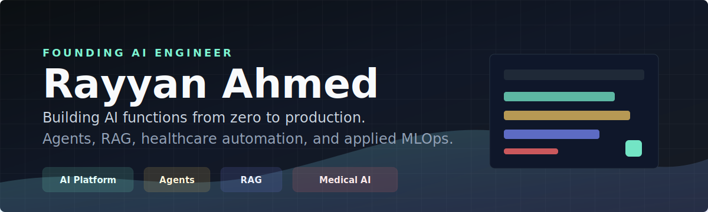
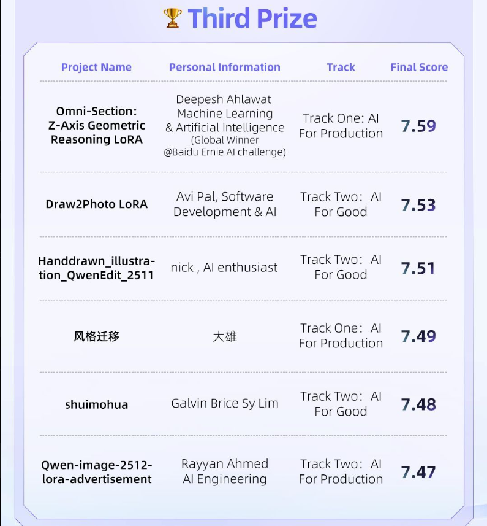
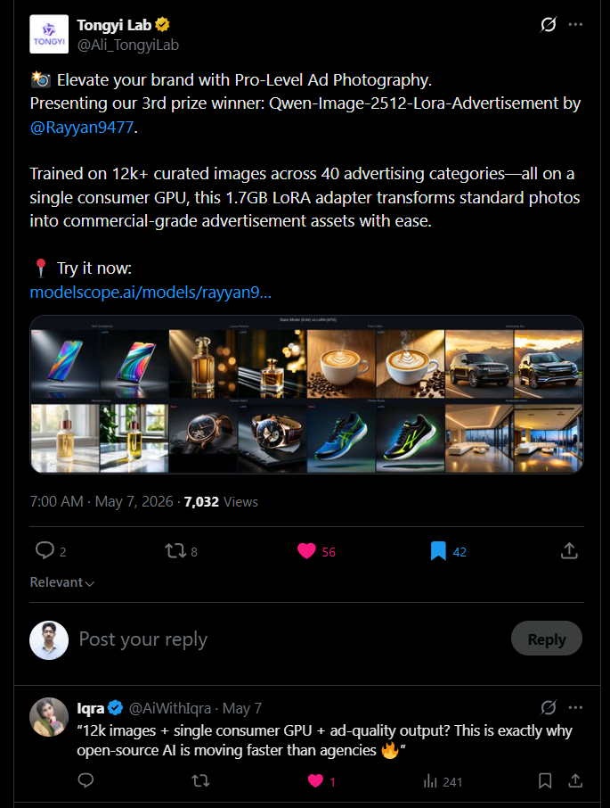
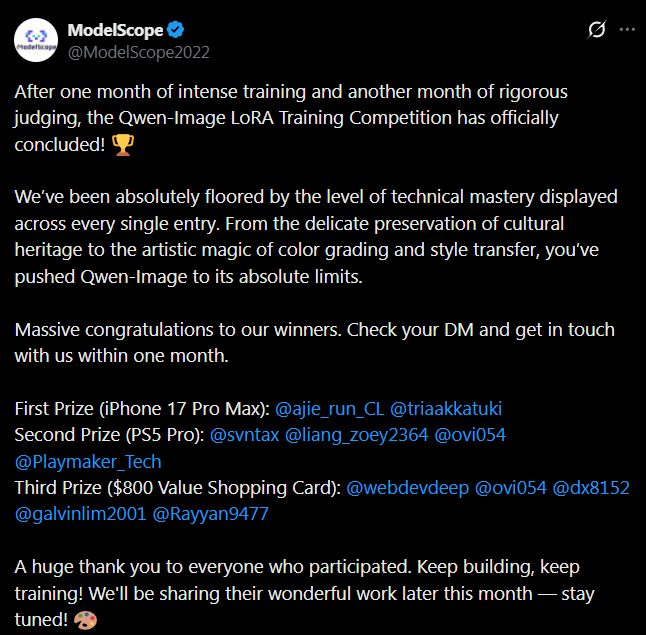

<!-- Quote Updated: June 06, 2026 at 03:57 AM UTC -->

  

  
  
  
  

  
  
  
  

  <table>
    <tr>
      <td align="center" width="25%">
        
         
        <strong><!--PROFILE_VIEWS-->2,298<!--/PROFILE_VIEWS--></strong>
         
        Profile views
      </td>
      <td align="center" width="25%">
        
         
        <strong><!--FOLLOWERS-->78<!--/FOLLOWERS--></strong>
         
        Followers
      </td>
      <td align="center" width="25%">
        
         
        <strong><!--TOTAL_STARS-->172<!--/TOTAL_STARS--></strong>
         
        Total stars
      </td>
      <td align="center" width="25%">
        
         
        <strong><!--CURRENT_STREAK-->315<!--/CURRENT_STREAK--></strong>
         
        Day streak
      </td>
    </tr>
  </table>

## Focus

I am a founding AI engineer who builds the first version of things that do not exist yet: AI infrastructure, agent workflows, retrieval systems, validation loops, and production automations. My work turns messy operational processes into reliable pipelines that teams can actually use.

<table>
  <tr>
    <td width="33%">
      <h3>Agentic AI</h3>
      Multi-agent LangGraph workflows, browser automation, MCP servers, tool orchestration, and guardrail-driven execution.
    </td>
    <td width="33%">
      <h3>Document Intelligence</h3>
      OCR/VLM extraction, adaptive schemas, duplicate detection, validation loops, and structured exports for large batches.
    </td>
    <td width="33%">
      <h3>RAG and MLOps</h3>
      Hybrid retrieval, LLM integrations, drift monitoring, retraining pipelines, API serving, and production observability.
    </td>
  </tr>
</table>

## Current Work

**Founding AI Engineer** at **Nobility RCM** | Islamabad, Pakistan | March 2025 - Present

Joined as the company's founding AI engineer and started the AI function from scratch: technical direction, architecture, model workflows, automation strategy, evaluation patterns, and production delivery.

- Established the initial AI engineering stack for healthcare operations, including LangGraph agents, RAG pipelines, MCP integrations, Playwright browser automation, and validation-first LLM workflows.
- Built a medical compliance agent that reads clinical notes and extracts ICD-10, CPT, and HCPCS billing codes with a fine-tuned Phi-3 model, a 4-agent LangGraph workflow, and layered anti-hallucination checks.
- Developed LLM-powered browser automation agents with Playwright and Browser Use to navigate billing portals, extract claim data, and auto-fill repetitive workflows.
- Designed retrieval and knowledge workflows with FAISS vectors, BM25 keyword search, and internal system integrations so teams can query billing data in natural language.
- Turned early prototypes into repeatable internal systems by defining prompts, tools, state flows, validation steps, and operational handoff patterns.

## Recognition

  <table>
    <tr>
      <td align="center" width="25%">
        <strong>Third Prize</strong>
         
        Qwen-Image LoRA Training Competition
      </td>
      <td align="center" width="25%">
        <strong>12k+ Images</strong>
         
        Curated ad dataset
      </td>
      <td align="center" width="25%">
        <strong>40 Categories</strong>
         
        Commercial product domains
      </td>
      <td align="center" width="25%">
        <strong>7.47 Score</strong>
         
        AI for Production track
      </td>
    </tr>
  </table>

<table>
  <tr>
    <td width="58%">
      <h3>Qwen-image-2512-lora-advertisement</h3>
      
Won Third Prize for a 1.7GB LoRA adapter that transforms standard product photos into commercial-grade ad visuals. The model was trained on 12k+ curated images across 40 advertising categories on a single consumer GPU.

      
<strong>What this shows:</strong> dataset curation, LoRA fine-tuning, production taste, GPU discipline, and rapid iteration under competition constraints.

      

        
        
      

    </td>
    <td width="42%" align="center">
      
    </td>
  </tr>
</table>

  
<strong>Public recognition and proof</strong>

   
  <table>
    <tr>
      <td width="50%" align="center">
        
      </td>
      <td width="50%" align="center">
        
      </td>
    </tr>
  </table>

## What I Ship

<table>
  <tr>
    <td width="33%">
      <h3>Reliable Agents</h3>
      
Multi-step workflows with explicit tools, state, retry paths, and validation layers instead of loose chatbot behavior.

    </td>
    <td width="33%">
      <h3>Production AI</h3>
      
Systems that connect to real data, real portals, real users, and measurable outcomes.

    </td>
    <td width="33%">
      <h3>Fast Iteration</h3>
      
From research prototype to usable workflow with clean evaluation loops and practical deployment constraints.

    </td>
  </tr>
</table>

## Technical Stack

  

  
  
  
  
  
  

## Featured Work

<table>
  <tr>
    <td width="50%">
      <h3>Solace AI</h3>
      
Advanced mental-health assistant focused on empathetic conversation, privacy-first architecture, and analytics for wellness workflows.

      
<strong>Stack:</strong> Transformers, therapeutic NLP, AWS, Redis, PostgreSQL, Docker, Kubernetes

      
    </td>
    <td width="50%">
      <h3>Agentic Document Extraction</h3>
      
Enterprise extraction system for messy scans, adaptive schemas, multi-record pages, cross-page duplicates, and resumable batch processing.

      
<strong>Stack:</strong> Qwen3-VL, LangGraph, Mem0, OpenCV, FastAPI, Celery

      
    </td>
  </tr>
  <tr>
    <td width="50%">
      <h3>AutoApply AI</h3>
      
Full-stack job automation platform for discovery, resume scoring, tailored documents, human review, queues, WebSockets, and browser-based submission.

      
<strong>Stack:</strong> FastAPI, React, Playwright, Browser Use, Redis, LiteLLM, FAISS

      
    </td>
    <td width="50%">
      <h3>LinkedIn MCP Server</h3>
      
MCP server that gives LLM assistants structured LinkedIn job tooling for search, tailored resumes, cover letters, and application workflows.

      
<strong>Stack:</strong> Python, MCP, LinkedIn API, LLMs, FastAPI

      
    </td>
  </tr>
  <tr>
    <td width="50%">
      <h3>MLOps Pipeline - USD Volatility Forecasting</h3>
      
Production ML system that fetches live forex data, engineers 33 features, retrains every 2 hours, serves predictions through FastAPI, and monitors drift on each request.

      
<strong>Stack:</strong> Airflow, Grafana, Prometheus, MLflow, Docker, DVC, FastAPI

      
    </td>
    <td width="50%">
      <h3>Medical Compliance Agent</h3>
      
Production healthcare AI workflow that reads clinical notes, extracts billing codes, and validates outputs through a LangGraph agent architecture with anti-hallucination checks.

      
<strong>Stack:</strong> Phi-3 fine-tuning, LangGraph, RAG, validation agents, healthcare automation

      
    </td>
  </tr>
</table>

  

## GitHub Analytics

  
  

  

## Daily Inspiration

  

## Connect

  
  
  

  
  
  

<!-- Dynamic Content - Auto-updated via GitHub Actions -->
<!-- Last Updated: June 06, 2026 at 03:57 AM UTC -->

  Production AI, practical automation, and measurable delivery.

